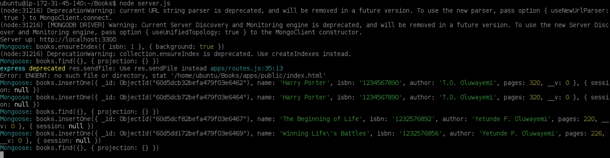
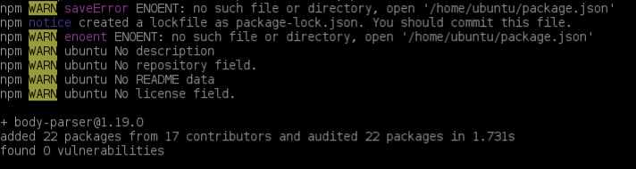
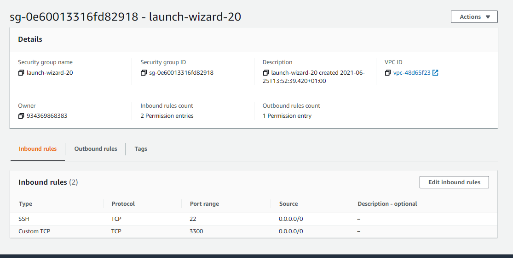
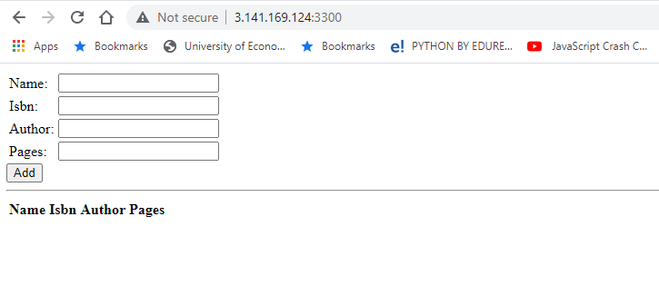
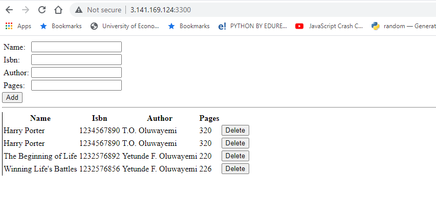

# MEAN STACK IMPLEMENTATION

 ### MEAN stack is combination of MongoDB, Express, Angular and Node.js

## Steps taken
* Install NodeJs
* Install MongoDB and start MonogDB 

* Install Node package manager
* Install body-parser package

* mkdir Books && cd Books
* npm init - to initializee npm project
* Install Express and set up routes to the server
* sudo npm install express mongoose
* Access the routes with AngularJS
* Start the server by running this command:node server.js
* 
* Open TCP port 3300 in your AWS Web Console

* curl -s http://localhost:3300
* Web book application register should look like this.

